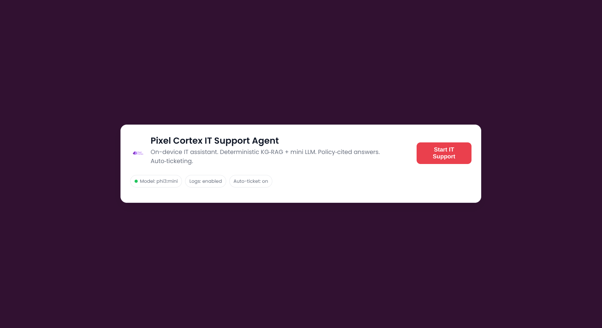
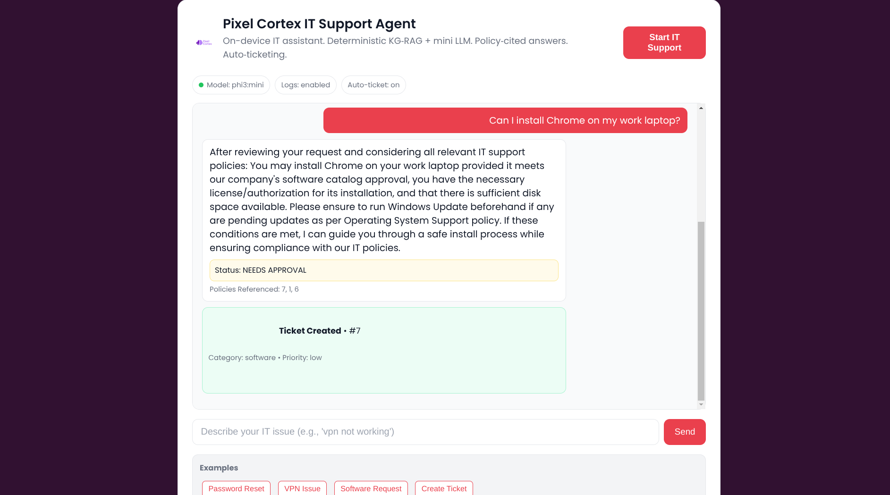
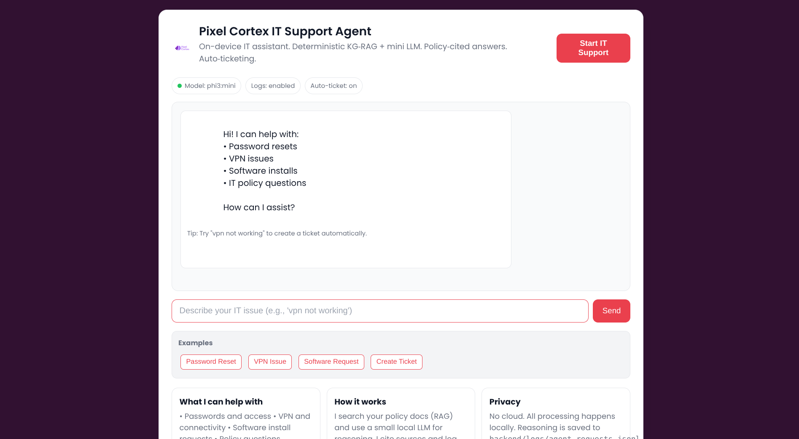
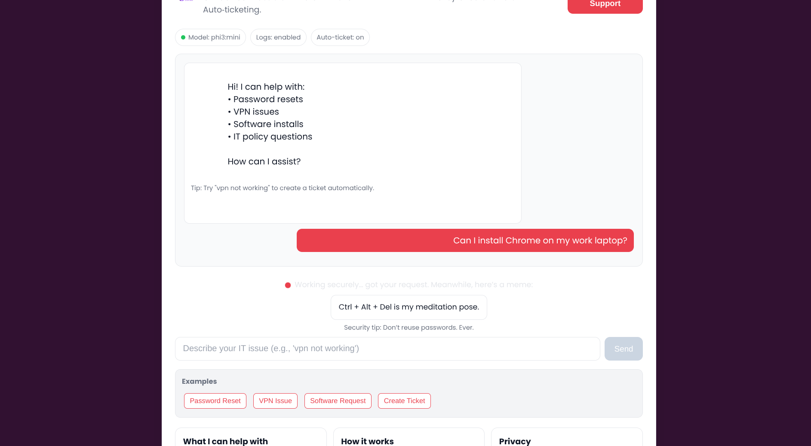

# Pixel Cortex - Local IT Support Agent with XAI

[](#) [](#) [](#) [](#)

Sarah Rashidi & Lana Bou Farrage

Link to the PPT
https://www.canva.com/design/DAGxiVLj5Is/YvxprSyYllFKoJCc2M6x2A/edit?ui=eyJBIjp7fX0

A local-first IT Support ticketing system with Explainable AI (XAI) that provides transparent, policy-grounded decisions for ticket triage and resolution planning.

## Table of Contents
- [Features](#features)
- [Quick Start (Local mini‑LLM, no cloud)](#quick-start-local-mini-llm-no-cloud)
- [Screenshots / UI](#screenshots--ui)
- [Architecture](#architecture)
- [API Endpoints](#api-endpoints)
- [Development Commands](#development-commands)
- [License](#license)
- [Contributing](#contributing)

## Features

### Core Functionality
- **Ticket Management**: Create, assign, prioritize, update status, and close tickets
- **Automated Triage**: Rule-based classification with confidence scoring
- **Policy-Grounded Planning**: Action plans derived from official IT policies
- **Explainable AI**: Complete transparency in decision-making process

### XAI Components
- **Reasoning Trace**: Step-by-step decision process
- **Policy Citations**: Direct references to policy chunks
- **Confidence Scoring**: Quantified certainty in recommendations
- **Alternative Options**: Other approaches considered
- **Counterfactuals**: "What if" scenarios
- **Performance Telemetry**: Latency and processing metrics

### Security & Compliance
- **Append-Only Audit Log**: Hash-chained tamper-evident logging
- **PII Redaction**: Automatic redaction of sensitive information
- **RBAC**: Role-based access control (Admin, Agent, User)
- **Deterministic Processing**: Same input always produces same output

## Quick Start (Local mini‑LLM, no cloud)

TL;DR (2 minutes)
1) Optional (for reasoning): start Ollama and pull mini model
```bash
# Install Ollama (Linux)
curl -fsSL https://ollama.com/install.sh | sh
ollama serve &
# In another terminal
ollama pull phi3:mini
export OLLAMA_MODEL=phi3:mini
```
2) Start the backend
```bash
pip install -r backend/requirements.txt
uvicorn backend.run_basic:app --host 0.0.0.0 --port 8000 --reload
```
3) Index policies so answers can cite
```bash
curl -sS -X POST http://localhost:8000/api/rag/index \
  -H 'Content-Type: application/json' \
  -d '{"policies_dir":"../policies"}'
```
4) Use the website
- Open http://localhost:8000
- Click "Start IT Support" and ask: vpn not working
- The agent replies with reasoning + citations, and auto‑creates a ticket

Logs
- Reasoning logs are appended to backend/logs/agent_requests.jsonl (one JSON line per request)
- Each entry includes: query, response, policies_cited, compliance_status, reasoning trace, ticket_created, and model_used

1) Install Ollama and pull a small model (choose one)
- Recommended: phi3:mini (quality)
- Ultra‑compact: tinyllama (smallest)

```bash
curl -fsSL https://ollama.com/install.sh | sh
ollama serve
# In another terminal
ollama pull phi3:mini
export OLLAMA_MODEL=phi3:mini
```

2) Install backend deps and start API
```bash
pip install -r backend/requirements.txt
uvicorn backend.run_basic:app --reload
```

3) Index bundled policies for RAG (so answers can cite)
```bash
curl -sS -X POST http://localhost:8000/api/rag/index \
  -H 'Content-Type: application/json' \
  -d '{"policies_dir":"../policies"}'
```

4) Ask for a grounded answer with checklist + decision + citations
```bash
# Deterministic KG‑RAG (no LLM, always grounded)
curl -sS -X POST http://localhost:8000/api/llm/chat \
  -H 'Content-Type: application/json' \
  -d '{"message":"How do I reset my password?","augment":true,"include_explanation":true}'

# True CoT via your mini model (Ollama)
curl -sS -X POST http://localhost:8000/api/llm/chat \
  -H 'Content-Type: application/json' \
  -d '{"message":"How do I reset my password?","augment":true,"include_explanation":true,"engine":"ollama"}'
```

5) Ticket lifecycle (auto create and close with citations)
```bash
# Auto‑create from a user request
curl -sS -X POST http://localhost:8000/api/agent/ask \
  -H 'Content-Type: application/json' \
  -d '{"query":"My VPN is not working"}'

# Or explicit create
curl -sS -X POST http://localhost:8000/api/agent/create-ticket \
  -H 'Content-Type: application/json' \
  -d '{"issue":"My VPN is not working"}'

# Resolve (stores resolution_reasoning + resolution_policy_citations)
curl -sS -X POST "http://localhost:8000/api/agent/resolve-ticket/<ID>?resolution_code=RESOLVED_VPN_CACHE_CLEAR"

# One-shot auto-ticket (type an issue, it creates ticket + returns grounded response)
curl -sS -X POST http://localhost:8000/api/agent/ask \
  -H 'Content-Type: application/json' \
  -d '{"query":"My VPN is not working"}'
# Response includes ticket_created: { ticket_id, title, category, priority, status }
```

Notes
- No OpenAI. Everything runs locally.
- Deployment files (Render/Docker) and audio endpoints were removed in this streamlined build.
- If Ollama is not running, deterministic KG‑RAG answers still include citations and reasoning.

New in this build
- Clean, flat UI with a neutral background (no flashy gradients) and a header logo (pixelCortexLogo)
- One‑shot auto‑ticket creation from /api/agent/ask with reasoning + policy citations
- Reasoning logs are appended to backend/logs/agent_requests.jsonl (one JSON per request)
- Styled 404 page for browser requests
- Safer frontend ticket rendering (supports ticket_created.ticket_id and ticket_created.id)

Screenshots / UI
- Open http://localhost:8000 to use the lightweight chat UI
- Click "Start IT Support" to reveal the chat
- Try: "vpn not working" — it returns the grounded answer and creates a ticket, all in one response
- Swagger UI: http://localhost:8000/docs (execute /api/agent/ask for a JSON response)

**Figure 1 — Home / Hero**



**Figure 2 — Ask the IT Agent**



**Figure 3 — Policy‑Cited Response**



**Figure 4 — One‑shot Ticket Created**



## Architecture

### Backend (FastAPI + PostgreSQL)
- **API Gateway**: JWT authentication with RBAC
- **Ticket Service**: CRUD operations with event tracking
- **Triage Service**: Rule-based categorization (regex/keyword matching)
- **Policy Retriever**: Hybrid BM25 + TF-IDF search over chunked documents
- **Planner Service**: Maps categories to policy-grounded action checklists
- **XAI Service**: Assembles comprehensive explanation objects
- **Audit Service**: Hash-chained logging for tamper detection


## Quick Start

### Lightweight RAG+KG (Local, no Docker)

This mode runs the optimized backend and the React frontend with the new RAG + Knowledge Graph and AI Workbench. It uses a fast local LLM (qwen2.5:0.5b via Ollama) and TF‑IDF for retrieval.

1) Install Ollama and pull the model

```bash
# Install Ollama (Linux)
curl -fsSL https://ollama.ai/install.sh | sh

# Pull a small, fast model
ollama pull qwen2.5:0.5b
```

2) Start the backend (lightweight demo)

```bash
cd backend
python3 -m venv venv
source venv/bin/activate

# Minimal dependencies for the demo backend
pip install fastapi uvicorn[standard] scikit-learn networkx joblib python-jose[cryptography] passlib[bcrypt]

# Optional: CPU-only audio (Vosk) for /api/audio/transcribe
pip install vosk soundfile
# Download a small English model (example)
# mkdir -p models && cd models
# wget https://alphacephei.com/vosk/models/vosk-model-small-en-us-0.15.zip && unzip vosk-model-small-en-us-0.15.zip
# export AUDIO_ENGINE=vosk
# export VOSK_MODEL_PATH=$(pwd)/vosk-model-small-en-us-0.15

# Run the simplified backend with RAG+KG + AI endpoints
uvicorn main_simple:app --host 0.0.0.0 --port 8000 --reload
```

Logs are written to backend/logs/agent_requests.jsonl (one JSON line per request).

### CPU-only Audio (Vosk) – New Default

### True LLM with CoT (Ollama) – Optional
Run a neural LLM locally with full CoT prompting and audit-safe reasoning extraction.

Local setup:
```bash
# Install Ollama
curl -fsSL https://ollama.ai/install.sh | sh

# Pull a small model (recommended for CPU)
ollama pull qwen2.5:0.5b

# Start Ollama server (in a separate terminal)
ollama serve

# Optional: set model via env
export OLLAMA_MODEL=qwen2.5:0.5b
```

Use the API:
- POST /api/llm/chat with body: { "message": "...", "engine": "ollama" }
- Returns final answer + explanation (CoT extracted and stored).

Note for Render: the default Python runtime won’t run Ollama on the instance. Use the deterministic engine on Render, and use Ollama locally, or switch to the Docker runtime that starts Ollama.
Vosk provides offline speech-to-text on CPU with a small model footprint. This replaces Whisper/Torch in the lightweight mode and keeps deploy size under 500MB.

Setup locally:
```bash
pip install vosk soundfile
# Download a small English model (~50–60MB), e.g.:
mkdir -p models && cd models
wget https://alphacephei.com/vosk/models/vosk-model-small-en-us-0.15.zip
unzip vosk-model-small-en-us-0.15.zip
export AUDIO_ENGINE=vosk
export VOSK_MODEL_PATH=$(pwd)/vosk-model-small-en-us-0.15
```

Render deployment (CPU-only):
- The backend uses the Python runtime with minimal deps (requirements.render.txt).
- Set environment variables in the backend service:
  - AUDIO_ENGINE=vosk
  - VOSK_MODEL_PATH=/opt/models/vosk-model-small-en-us-0.15
- Optionally attach a small disk to store the Vosk model and fetch it at first boot.

API compatibility:
- In the full backend, audio endpoints remain the same (/api/audio/upload, /api/audio/transcribe).
- The lightweight demo exposes /api/audio/test to verify the audio stack.

### Render Deployment (Blueprint)
Using render.yaml, deploy both backend and frontend directly from GitHub:

1) Commit and push your changes
```bash
git add -A
git commit -m "Switch to CPU Vosk audio + Render blueprint"
git push
```
2) In Render dashboard: New -> Blueprint -> select this repo -> Apply
3) After deploy:
- Backend health: GET {backend_url}/health
- Frontend is built and published as a static site
- Configure env vars as needed: SECRET_KEY (auto), DATABASE_URL (auto from managed Postgres), CORS_ALLOW_ORIGINS, AUDIO_ENGINE=vosk, VOSK_MODEL_PATH

Demo accounts:
- Admin: admin / admin123
- Agent: agent1 / agent123
- User: user1 / user123

### Local Run (CPU) — Step-by-step

Prereqs
- Python 3.10+ and pip
- Node 16+ (for the frontend)
- Optional for true LLM: Ollama installed

1) Backend deps (CPU)
```bash
cd backend
python3 -m venv venv
source venv/bin/activate
pip install -r requirements.render.txt
# Optional: download NLTK data once
python -m nltk.downloader punkt stopwords
```

2) Seed demo users and sample tickets
```bash
python - << 'PY'
import os
os.environ["DATABASE_URL"]="sqlite:///./pixel_cortex.db"
from app.core.database import engine
from app.models import models
models.Base.metadata.create_all(bind=engine)
from app.core.seed import seed_database
seed_database()
print("Seed done")
PY
```
Demo logins:
- admin / admin123
- agent1 / agent123
- user1 / user123

3) Start the backend (CPU Vosk audio enabled)
```bash
# Optional: choose a user-writable model path for Vosk
export VOSK_MODEL_PATH="$HOME/models/vosk-model-small-en-us-0.15"
uvicorn run_basic:app --host 0.0.0.0 --port 8000
```
Notes: first audio call auto-downloads the Vosk model to VOSK_MODEL_PATH.


6) Test KG‑Lite endpoints (optional)
```bash
curl -s http://localhost:8000/api/kg-lite/stats
curl -s 'http://localhost:8000/api/kg-lite/concepts?limit=20'
curl -s 'http://localhost:8000/api/kg-lite/path?source=VPN&target=MFA'
```


## API (minimal, used)
- POST /api/rag/index – index policies for grounded answers (body: { policies_dir: string })
- GET /api/agent/model-status – check which mini model is configured
- POST /api/agent/ask – returns the grounded response and ticket_created in one call
- POST /api/agent/resolve-ticket/{id}?resolution_code=... – optional close with citations

## XAI Explanation Object Schema

Every AI decision includes a comprehensive explanation:

```json
{
  "answer": "Human-readable summary of the decision",
  "decision": "Structured decision string (category=hardware, priority=high)",
  "confidence": 0.85,
  "reasoning_trace": [
    {
      "step": 1,
      "action": "text_analysis", 
      "rationale": "Analyzed input for keywords and patterns",
      "confidence": 0.9,
      "policy_refs": []
    }
  ],
  "policy_citations": [
    {
      "document_id": 1,
      "document_title": "Hardware Policy",
      "chunk_id": 5,
      "chunk_content": "When computer won't turn on, check power connections...",
      "relevance_score": 0.87
    }
  ],
  "missing_info": ["Specific error message", "Device model"],
  "alternatives_considered": [
    {
      "option": "Manual categorization",
      "pros": ["100% accuracy", "Human oversight"],
      "cons": ["Slower", "Requires expertise"],
      "confidence": 0.95
    }
  ],
  "counterfactuals": [
    {
      "condition": "If this were a security issue",
      "outcome": "Immediate isolation would be required",
      "likelihood": 0.1
    }
  ],
  "telemetry": {
    "latency_ms": 150,
    "retrieval_k": 5,
    "triage_time_ms": 100,
    "planning_time_ms": 50,
    "total_chunks_considered": 8
  },
  "timestamp": "2024-01-01T12:00:00Z",
  "model_version": "1.0.0"
}
```


3. **Database setup**:
```bash
# Install PostgreSQL locally or use Docker
docker run -d --name pixel-postgres -e POSTGRES_DB=pixel_cortex -e POSTGRES_USER=pixel_user -e POSTGRES_PASSWORD=pixel_pass -p 5432:5432 postgres:15
```

## Policy Management

The system supports multiple policy document formats:

### Supported Formats
- **Markdown (.md)**: Rendered and chunked for search
- **PDF (.pdf)**: Text extracted and chunked
- **Text (.txt)**: Direct processing

### Adding Policies
1. Place policy documents in the `policies/` directory (or set POLICIES_DIR in .env)
2. In Lightweight mode, build index with: `POST /api/rag/index` (AI Workbench UI provides a button)
3. In the original stack, you can reindex via `POST /api/policies/reindex` (if enabled)

### Sample Policies Included
- `hardware_policy.md`: Hardware troubleshooting procedures
- `network_security_policy.md`: Network and security incident response
- `software_policy.md`: Software installation and support procedures

## Testing

### Backend Tests
```bash
cd backend
python -m pytest tests/ -v
```

### Test Categories
- **XAI Schema Validation**: Ensures explanation objects conform to schema
- **Policy Grounding**: Verifies citations are faithful to source policies
- **Determinism Tests**: Confirms same input produces same output
- **Audit Chain Validation**: Verifies tamper-evident logging integrity

### Sample Test Commands
```bash
# Test XAI schema validation
python -m pytest tests/test_xai_schema.py -v

# Test policy grounding
python -m pytest tests/test_policy_grounding.py -v

# Test determinism
python -m pytest tests/test_determinism.py -v
```

## Core Design Principles

### Deterministic
- Same input always produces same output and citations
- Deterministic ordering of search results and processing steps
- Reproducible explanations for audit and compliance

### Faithful
- Every claim tied to specific policy chunk citations
- No hallucination - all recommendations grounded in policies
- Explicit acknowledgment when policy guidance is insufficient

### Private
- PII automatically redacted from all logs and explanations
- Local-first architecture - no external API calls
- User data remains within organization boundaries

### Tamper-Evident
- Append-only hash-chained audit log
- Cryptographic verification of log integrity
- Detection of missing or modified entries

## Production Deployment Notes

### Security Hardening
1. Change default passwords in `.env`
2. Use strong JWT secret keys
3. Enable HTTPS with proper certificates
4. Configure firewall rules
5. Regular security updates

### Scaling Considerations
- PostgreSQL can be configured for high availability
- Backend can be horizontally scaled behind load balancer
- Policy indexing can be moved to background workers
- Add Redis for caching frequent queries

### Monitoring
- Health check endpoints available at `/health`
- Comprehensive telemetry in every XAI explanation
- Audit log provides complete activity trail
- Performance metrics tracked per operation

## Troubleshooting

### Common Issues

**Backend won't start**:
- Check PostgreSQL connection
- Verify environment variables in `.env`
- Ensure required Python packages are installed

**Frontend build errors**:
- Run `npm install` to ensure dependencies are current
- Check Node.js version (requires 16+)
- Verify API_URL is correctly configured

**Policy indexing fails**:
- Check `policies/` directory exists and contains supported files
- Verify file permissions allow reading
- Check backend logs for specific error messages

**Tests failing**:
- Ensure test database is clean: `rm test.db`
- Install test dependencies: `pip install -r requirements.txt`
- Run tests individually to isolate issues

## License

MIT License - see LICENSE file for details.

## Contributing

1. Fork the repository
2. Create feature branch
3. Add tests for new functionality
4. Ensure all tests pass
5. Submit pull request with clear description

For questions or support, please open an issue in the GitHub repository.


